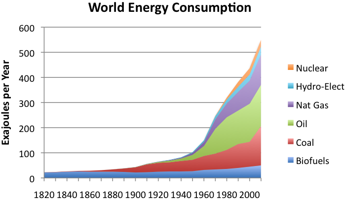
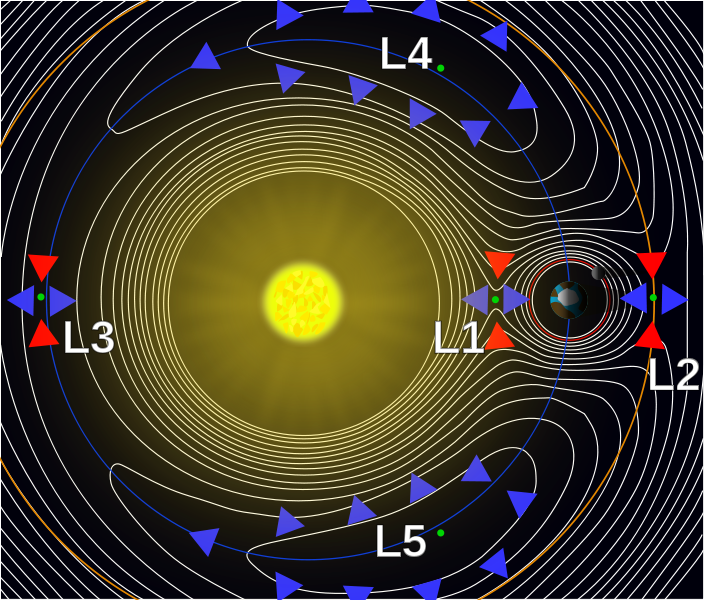
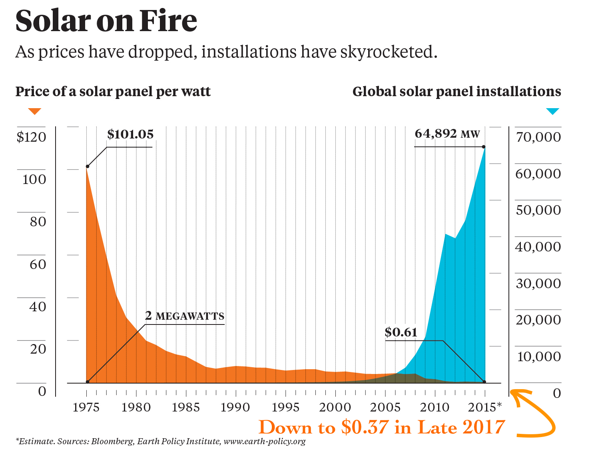

_Fair warning: This is going to be my most self-righteous post to date._

Finally people are waking up to what I've been saying since 2008[^1]: batteries are the future! Combined with solar cells they are a complete and by far the best solution for our long-term terrestrial energy needs. Fusion will be great for space travel and can of course be used on Earth alongside wind and hydro power because... why not? No harm in diversifying our energy generation a little and unlike bio fuel, they don't cause more trouble than they are worth, i.e. they don't compound the scarcity of fresh water and agricultural area. But we won't need them. Even nuclear power as a transitionary technology to help us reach sustainability without emitting catastrophic amounts of CO2 into the atmosphere is overrated in my opinion.

Just to give you an idea of the incredibly high ceiling for solar on Earth: In a _single hour_, more energy in the form of sunlight hits our planet than a greedy human population approaching 8 billion can consume in an entire year.

Humanity could continue to advance and increase its energy consumption at the current rate for centuries harnessing only solar power without problems. Certainly not so with wind and hydro and probably not even with fusion, simply because nothing in the solar system could ever come even close to the energy released by the sun. And with the sun comprising 99.8 % of all mass in our solar system, short of us discovering a huge pile of antimatter lying around somewhere this isn't going to change.

_World energy consumption by source. Credit: [The Oil Drum](http://www.theoildrum.com/node/9023)_

Even if our energy demands should exceed the amount of sun light reaching the Earth, i.e. increase by more than a factor of the number of hours in a year ($24 \cdot 365 = 8760$), all we'd have to do is start harnessing solar radation from space. This has a number of advantages anyway.

1. We avoid losing energy to light scattering in our atmosphere.
2. Solar cells in space could receive sunlight all day every day by placing them on one of the Lagrange points for instance.

_Contour plot of the effective potential due to gravity and the centrifugal force in the Sun-Earth system. Credit: [Wikipedia][1]_

Once we start collecting the sun's light in space, the new ceiling for max solar energy collection becomes a [Dyson sphere](https://en.wikipedia.org/wiki/Dyson_sphere), i.e. a sphere enclosing the entire sun. Covering its inside with solar cell would allow us to harness all of the sun's energy! At that point we should comfortably be able to test string theory. :sunglasses:

_Artist's rendition of a Dyson sphere. Credit: [Danielle Futeslaar](https://www.abc.net.au/news/2015-12-10/artists-representation-of-dyson-sphere-surrounding-star/7019336)_

Just to demonstrate the long term scalability of the sun as an energy source, looking again at the plot of the world's energy consumption over time, we can see that it increased from $E_{1950} \approx 100 \, \mathrm{E J} = 10^{20} \, \mathrm J$ to $E_{2000} \approx 420 \, \mathrm{EJ} = 4.2 \cdot 10^{20} \, \mathrm J$, i.e. a 4.2-fold increase over a period of $t = 50$ years. That equates to an average annual increase in human energy consumption $c$ of

$$
E_{1950} \cdot (1 + c)^t = E_{2000}
\quad\Rightarrow\quad
c = \exp\biggl(\frac{1}{t}\ln\bigl(E_{2000}/E_{1950}\bigr)\biggr) - 1 \approx 0.0327124199
$$

i.e. roughly 3.3 %. Projecting this growth rate and the world's total energy consumption in 2013 estimated to be $E_{2013} = 5.67 \cdot 10^{20} \mathrm J$ ([source](https://en.wikipedia.org/wiki/World_energy_consumption)) into the future, the time it would take us to reach a consumption equaling the sun's output of about $E_\odot \approx 1.21 \cdot 10^{34} \mathrm J$ is

$$
E_{2013} (1 + c)^T = E_\odot
\quad\Rightarrow\quad
T = \frac{\ln\bigl(E_\odot/E_{2013}\bigr)}{\ln(1 + c)} \approx 947
$$

It would take us close to a thousand years of continuing the period of strongest increase in human power consumption to reach the sun's total energy output.

But I digress. Basically my point is that solar energy is obviously by far the best long-term solution for all our energy needs and (perhaps slightly less obviously) - here comes the core message of this blog post - the best short term solution as well when combined with large-scale batteries.

The price of solar has seen such a steady and rapid decrease that it won't take much longer for it to drastically undercut every other method of energy generation humanity has yet developed.

_Solar energy price drop and rise in global installations. Credit: [CleanTechnica](https://cleantechnica.com/2018/02/11/solar-panel-prices-continue-falling-quicker-expected-cleantechnica-exclusive)_

In fact, in sunny countries this is already the case. In early 2018, Saudi Arabian operator ACWA Power reported they are able to operate their newest solar park at an [incredible tariff of 2.34 cents per kilowatt hour](https://cleantechnica.com/2018/02/06/acwa-power-develop-first-ever-utility-scale-renewable-project-saudi-arabia-record-breaking-tariff)! There's simply no other technology that can compete with this, let alone be sustainable. With solar cell technology continuing to improve, global manufacturing continuing to increase to economies of enormous scale, imagine where that figure is going to be in 10 years time.

The reason why I'm writing this blog post now is that I just watched an excellent video on one of my favorite YouTube channels called [ColdFusion](https://www.youtube.com/channel/UC4QZ_LsYcvcq7qOsOhpAX4A) in which Dagogo excellently outlines recent advances in battery technology and why they are the most viable solution for intermediate power storage of renewable energies. Take a look at the video and I think you'll have to agree, the solution to global warming is right in front us. It's as simple as building out our solar cell and battery manufacturing capabilities as quickly as we can.

`youtube:dOn-L6nUS54`

[1]: https://en.wikipedia.org/wiki/lagrangian_point

[^1]: Basically ever since I first heard of Tesla. I still remember that day and how I excited I was that someone had finally come along that took sustainable technologies seriously and was willing to invest all the necessary time, effort and capital to push their applications far enough to enable to transform our entire fossil fuel-driven economy.
